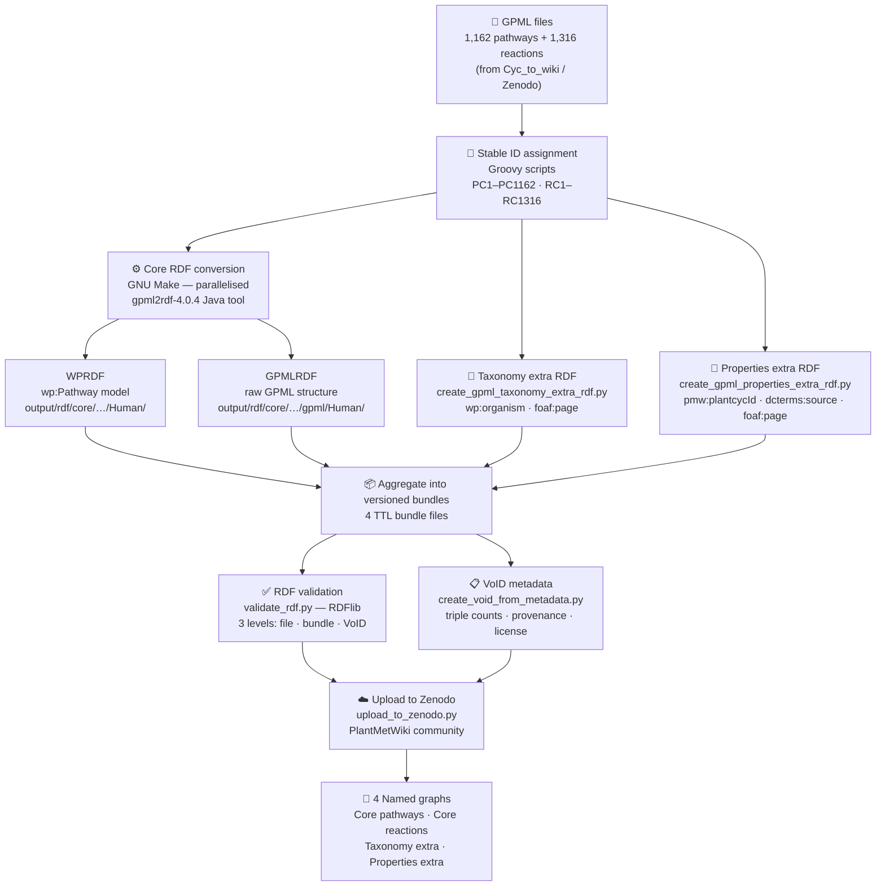

# GPML to RDF for PlantMetWiki

[](https://doi.org/10.5281/zenodo.17967619)
[](https://github.com/pathway-lod/gpml-to-rdf/releases)
[](https://plantmetwiki.bioinformatics.nl/)

Converts PlantCyc-derived GPML2021 pathway and reaction files into RDF using the WikiPathways GPMLRDF stack. The output feeds the [PlantMetWiki](https://plantmetwiki.bioinformatics.nl/) SPARQL endpoint.

## Three-layer RDF architecture

| Layer | Script | Output |
|---|---|---|
| **Core WikiPathways RDF** | `make -B -k -j 12 rdf` (Java) | `output/rdf/core/` |
| **Taxonomy extra RDF** | `create_gpml_taxonomy_extra_rdf.py` | `output/rdf/taxonomy-extra/` |
| **GPML property extra RDF** | `create_gpml_properties_extra_rdf.py` | `output/rdf/properties-extra/` |

The plugin layers preserve PlantCyc-specific information while keeping the core WikiPathways RDF model unchanged.

## Pipeline overview

```
1.  Download GPML         →  input/gpml/original/
2.  Rename files          →  input/gpml/renamed/   (stable PC*/RC* identifiers)
3.  Generate index        →  pathways.txt, reactions.txt
4.  Core RDF              →  output/rdf/core/
5.  Taxonomy extra        →  output/rdf/taxonomy-extra/
6.  Properties extra      →  output/rdf/properties-extra/
7.  Bundle                →  output/bundles/all-*.ttl
8.  VoID metadata         →  output/bundles/void-*.ttl
9.  Validate              →  pass/fail per bundle
10. Upload to Zenodo      →  draft record

NCBI Taxonomy labels are resolved at the SPARQL-endpoint side by loading the OBO Foundry `ncbitaxon.owl` (CC0) into a dedicated `graph/ncbitaxon` graph in Virtuoso — see the [Snorql-UI repo](https://github.com/pathway-lod/Snorql-UI) (`scripts/load-graphs/load-ncbitaxon.sh`). The pipeline emits OBO Foundry IRIs (`http://purl.obolibrary.org/obo/NCBITaxon_<id>`) that match those IRIs exactly, so a simple cross-graph join replaces the older OBO↔BioPortal `owl:sameAs` mapping.
```

---

## Set up the environment

```bash
mamba env create -f environment.yml
conda activate plantmetwiki-rdf
```

All Python and Groovy commands below assume the environment is activated. The `make` step requires `conda run -n plantmetwiki-rdf make ...` explicitly because Make subshells do not inherit the activated conda environment and would otherwise use the system Java (which may be too old).

---

## 1. Prepare GPML input

### Option A — download from Zenodo (recommended for reproducible builds)

The concept DOI `10.5281/zenodo.18404067` always resolves to the latest PlantCyc GPML2021 release:

```bash
python scripts/download_gpml_input.py --clean
```

Files are saved to `input/gpml/original/pathways/` and `input/gpml/original/reactions/`.

### Option B — copy from a local GitHub checkout (useful for development branches)

```bash
gh repo clone pathway-lod/Cyc_to_wiki
mkdir -p input/gpml/original/pathways input/gpml/original/reactions
cp ../Cyc_to_wiki/<VERSION_FOLDER>/individual_pathways/*.gpml input/gpml/original/pathways/
cp ../Cyc_to_wiki/<VERSION_FOLDER>/individual_reactions/*.gpml input/gpml/original/reactions/
```

Replace `<VERSION_FOLDER>` with the relevant output directory, e.g. `plantcyc17.0.0-gpml2021-v1__git<sha>__<timestamp>`.

---

## 2. Rename GPML files

The converter expects stable `PC*` / `RC*` identifiers:

```bash
mkdir -p input/gpml/renamed/pathways input/gpml/renamed/reactions
groovy scripts/createPathwayfiles.groovy
groovy scripts/createReactionfiles.groovy
```

Output: `input/gpml/renamed/pathways/PC1.gpml … PC1162.gpml` and `input/gpml/renamed/reactions/RC1.gpml … RC1316.gpml`.

**Reproducibility check** — verify that the renamed files match the downloaded version before proceeding:

```bash
python -c "
import json, re, xml.etree.ElementTree as ET
meta = json.load(open('build/zenodo_gpml_metadata.json'))
gpml_ver = ET.parse('input/gpml/renamed/pathways/PC1.gpml').getroot().get('version', 'NOT FOUND')
# GPML version format: 17.0.0_YYYYMMDD-HHMMSS — extract the embedded date for comparison
m = re.match(r'\d+\.\d+\.\d+_(\d{4})(\d{2})(\d{2})', gpml_ver)
gpml_date = f'{m.group(1)}-{m.group(2)}-{m.group(3)}' if m else 'unparseable'
pub_date = meta.get('publication_date', '')
status = 'OK — dates match' if gpml_date == pub_date else 'MISMATCH — renamed files may be from a different release, re-run Groovy scripts'
print(f'Zenodo release : {meta[\"version\"]}  (DOI: {meta[\"doi\"]},  published: {pub_date})')
print(f'GPML file ver  : {gpml_ver}  (date extracted: {gpml_date})')
print(status)
"
```

If the output shows `MISMATCH`, the renamed files are stale — re-run the Groovy steps above before continuing.

---

## 3. Generate index files

Make reads `pathways.txt` and `reactions.txt` at parse time to determine build targets — generate them before running `make rdf`:

```bash
make pathways.txt reactions.txt
```

---

## 4. Generate core WikiPathways RDF

```bash
conda run -n plantmetwiki-rdf make -B -k -j 12 rdf
```

Flags:
- `-B` — force rebuild (Make reads the index files at parse time)
- `-k` — keep going past individual file errors
- `-j 12` — run 12 jobs in parallel (adjust to available CPU cores)
- `conda run -n plantmetwiki-rdf` — ensures Java 11+ from the conda environment

For each GPML file, two Turtle files are created:
- `output/rdf/core/pathways/Human/` — **WPRDF** (WikiPathways RDF, standard model)
- `output/rdf/core/pathways/gpml/Human/` — **GPMLRDF** (direct GPML structure in RDF)

---

## 5. Generate taxonomy extra RDF

Adds `wp:organism` triples at pathway and DataNode level:
- `ncbi:33090` (Viridiplantae) on every pathway and reaction
- Species-specific NCBI taxon IDs on GeneProduct, Protein, and Metabolite nodes where GPML contains `<AnnotationRef>` taxonomy annotations

```bash
VERSION=$(python -c 'import json; print(json.load(open("build/zenodo_gpml_metadata.json"))["version"])')

python scripts/create_gpml_taxonomy_extra_rdf.py \
  --aggregate-file output/bundles/all_gpml_taxonomy_extra-${VERSION}.ttl
```

The `--aggregate-file` flag is required to get the correct versioned output name — the script default is hardcoded to an older name.

Output: `output/rdf/taxonomy-extra/` and `output/bundles/all_gpml_taxonomy_extra-<VERSION>.ttl`.

Quick checks:
```bash
grep -R "ncbi:33090" output/rdf/taxonomy-extra | head   # Viridiplantae
grep -R "ncbi:3702"  output/rdf/taxonomy-extra | head   # Arabidopsis thaliana
```

Suggested Virtuoso graph: `http://rdf-plantmetwiki.bioinformatics.nl/graph/gpml-taxonomy-extra`

---

## 6. Resolving NCBI Taxonomy labels (handled at the SPARQL endpoint)

The taxonomy-extra bundle emits OBO Foundry IRIs (`http://purl.obolibrary.org/obo/NCBITaxon_<id>`) which match the canonical IRIs used by the NCBITaxon ontology published by OBO Foundry. Label resolution and reasoning over the taxonomy are therefore done **at the SPARQL endpoint**, by loading the OBO Foundry release of NCBITaxon (CC0) into a dedicated named graph next to the pathway data.

The loader script and instructions live in the Snorql-UI repository:
- https://github.com/pathway-lod/Snorql-UI → `scripts/load-graphs/load-ncbitaxon.sh`

Example cross-graph query (label lookup, no federation required):

```sparql
PREFIX wp:   <http://vocabularies.wikipathways.org/wp#>
PREFIX rdfs: <http://www.w3.org/2000/01/rdf-schema#>

SELECT ?taxon ?label (COUNT(DISTINCT ?pwy) AS ?n_pathways)
WHERE {
  GRAPH <http://rdf-plantmetwiki.bioinformatics.nl/graph/gpml-taxonomy-extra> {
    ?pwy wp:organism ?taxon .
  }
  GRAPH <http://rdf-plantmetwiki.bioinformatics.nl/graph/ncbitaxon> {
    ?taxon rdfs:label ?label .
  }
}
GROUP BY ?taxon ?label
ORDER BY DESC(?n_pathways)
```

A previous version of the pipeline published OBO↔BioPortal `owl:sameAs` mappings to enable federated queries against BioPortal. That approach has been retired because (1) the OBO Foundry release is CC0 (BioPortal is not freely redistributable), (2) hosting NCBITaxon locally avoids a runtime federation dependency, and (3) the pathway IRIs already use the OBO Foundry IRI scheme, so no IRI mapping is needed.

---

## 7. Generate GPML property extra RDF

Preserves all `<Property key="" value="">` elements from Pathway, DataNode, and Interaction elements as `pmw:gpmlProperty` blank nodes:

```bash
VERSION=$(python -c 'import json; print(json.load(open("build/zenodo_gpml_metadata.json"))["version"])')

python scripts/create_gpml_properties_extra_rdf.py \
  --aggregate-file output/bundles/all_gpml_properties_extra-${VERSION}.ttl
```

The `--aggregate-file` flag is required to get the correct versioned output name — the script default is hardcoded to an older name.

Output: `output/rdf/properties-extra/` and `output/bundles/all_gpml_properties_extra-<VERSION>.ttl`.

To inspect which property keys exist and how often:

```bash
python scripts/audit_gpml_properties.py
# output/audit/gpml_property_audit_summary.csv
# output/audit/gpml_property_audit_by_scope.csv
```

Suggested Virtuoso graph: `http://rdf-plantmetwiki.bioinformatics.nl/graph/gpml-properties-extra`

---

## 8. Bundle core RDF

Set a version label and assemble the core bundle. `bundle_rdf.py` writes each `@prefix` declaration exactly once at the top so prefixes are never duplicated across the thousands of individual TTL files:

```bash
VERSION="plantcyc17.0.0-gpml2021-v1"

python scripts/bundle_rdf.py \
  --input-dir output/rdf/core/pathways \
  --input-dir output/rdf/core/reactions \
  --output    output/bundles/all-${VERSION}.ttl
```

Apply hotfixes to normalise identifiers:

```bash
perl -pi -e 's|identifiers\.org/TAIR_gene_name|identifiers.org/tair.name|g' output/bundles/all-${VERSION}.ttl
perl -pi -e 's|SLM_SLM%3A|SLM_|g' output/bundles/all-${VERSION}.ttl
perl -pi -e 's|/obo/NCBI Taxonomy_|/obo/NCBITaxon_|g' output/bundles/all-${VERSION}.ttl
perl -pi -e 's|/obo/NCBITaxon_131567|/obo/NCBITaxon_33090|g' output/bundles/all-${VERSION}.ttl
```

The last hotfix corrects a BridgeDb species-lookup gap: the Java `gpml2rdf` tool resolves the GPML `organism="Viridiplantae"` attribute against `org/bridgedb/bio/organisms.tsv` (bundled in `tools/gpml2rdf-4.0.4-SNAPSHOT.jar`), which only lists individual species (e.g. "Arabidopsis thaliana"), not kingdom-level names. Since "Viridiplantae" isn't in that table, the tool falls back to NCBI taxon `131567` ("cellular organisms") for the pathway-level `wp:organism` triple in the core RDF graph. The correct `ncbi:33090` (Viridiplantae) triple is added separately and correctly by `create_gpml_taxonomy_extra_rdf.py` in the taxonomy-extra graph — this hotfix just brings the core graph's pathway-level value in line with it.

Optional syntax validation (requires `rapper`):

```bash
rapper -i turtle -t -q output/bundles/all-${VERSION}.ttl > /dev/null
```

---

## 9. Create VoID metadata

```bash
VERSION=$(python -c 'import json; print(json.load(open("build/zenodo_gpml_metadata.json"))["version"])')

python scripts/create_void_from_metadata.py \
  --core-rdf         output/bundles/all-${VERSION}.ttl \
  --taxonomy-extra   output/bundles/all_gpml_taxonomy_extra-${VERSION}.ttl \
  --properties-extra output/bundles/all_gpml_properties_extra-${VERSION}.ttl \
  --output           output/bundles/void-${VERSION}.ttl
```

---

## 10. Validate RDF bundles

Run before uploading to Zenodo. Checks individual TTL files, bundle sizes, expected predicates, and the VoID file:

```bash
python scripts/validate_rdf.py
```

Use `--skip-individual` to skip per-file parsing (faster, used in CI):

```bash
python scripts/validate_rdf.py --skip-individual
```

---

## 11. Upload to Zenodo

### Option A — local upload

```bash
cp .env.template .env
# edit .env: set ZENODO_ACCESS_TOKEN=your-token-here

set -a && source .env && set +a
python scripts/upload_to_zenodo.py --source-record 18174552
```

Add `--sandbox` to test against the Zenodo sandbox first. The script creates a **draft** — review and publish it in the Zenodo UI.

> Set the license manually in the Zenodo UI: *OPEN DATABASE LICENSE FOR THE PLANT METABOLIC NETWORK DATABASES*

### Option B — GitHub Actions (recommended)

A `workflow_dispatch` workflow at `.github/workflows/upload-zenodo.yml` runs the full pipeline (download → rename → RDF → bundle → validate → upload):

1. Add `ZENODO_ACCESS_TOKEN` as a repository secret
2. Go to **Actions** → **Upload to Zenodo** → **Run workflow**
3. Enter the source Zenodo record ID

---

## Final output files

```
output/bundles/all-<VERSION>.ttl
output/bundles/all_gpml_taxonomy_extra-<VERSION>.ttl
output/bundles/all_gpml_properties_extra-<VERSION>.ttl
output/bundles/void-<VERSION>.ttl
```

Recommended Virtuoso graphs:
```
http://rdf-plantmetwiki.bioinformatics.nl/graph/pathways
http://rdf-plantmetwiki.bioinformatics.nl/graph/gpml-taxonomy-extra
http://rdf-plantmetwiki.bioinformatics.nl/graph/gpml-properties-extra
```

---

## Generating publication figures

Publication-quality figures are generated from Virtuoso via SPARQLWrapper — no local TTL files needed after the initial pipeline run.

### Architecture

```
Virtuoso (graph/pathways + graph/gpml-taxonomy-extra + graph/ncbitaxon)
    │
    ▼  python scripts/generate_figures_data.py   (~30 sec)
notebooks/figures/output/*.csv        ← committed to git
    │
    ▼  notebooks/plantmetwiki_figures.ipynb      (loads CSVs, no Virtuoso needed)
notebooks/figures/output/*.pdf/.svg
```

### Step 1 — generate CSV data from Virtuoso

```bash
conda activate plantmetwiki-rdf

# Full run (includes per-species metrics, ~5 min)
python scripts/generate_figures_data.py

# Skip the slower per-species query for quick iteration
python scripts/generate_figures_data.py --skip-species

# Custom endpoint
python scripts/generate_figures_data.py --endpoint http://localhost:8890/sparql
```

CSVs are written to `notebooks/figures/output/` and committed to git so figures can be regenerated without a running Virtuoso instance.

**Queries used:**

| CSV | Graph(s) | What it captures |
|---|---|---|
| `genes_per_pathway.csv` | `graph/pathways` | GeneProduct count per pathway |
| `metabolites_per_pathway.csv` | `graph/pathways` | Metabolite count per pathway |
| `enzymes_per_pathway.csv` | `graph/pathways` | Protein count per pathway |
| `conversions_per_pathway.csv` | `graph/pathways` | Conversion count per pathway |
| `interaction_types.csv` | `graph/pathways` | All wp: interaction type counts |
| `pathway_titles.csv` | `graph/pathways` | pwID → dc:title |
| `species_per_pathway.csv` | `graph/pathways` + `graph/gpml-taxonomy-extra` | Unique species per pathway |
| `per_species_nrs.csv` | all three graphs + `graph/ncbitaxon` | Pathways/genes/enzymes/metabolites per species, with NCBI labels |

Note: pathway titles use `dc:title` (not `rdfs:label`) in this dataset.
Species annotations are at the **DataNode level** in `graph/gpml-taxonomy-extra`, not at the pathway level — queries must join across named graphs.

### Species annotation model and indirect metrics

**Why only genes and enzymes have direct species tags:**
`wp:organism` annotations exist only on GeneProduct and Protein entities, derived from PlantCyc's `proteins.dat` SPECIES field. Metabolites, conversions (biochemical reactions), and publications have no direct species annotation — they represent shared biochemistry that occurs across organisms.

**Extended figure strategy — indirect association via shared pathway:**

```
species X → gene G (wp:organism ncbi:3702 in graph/gpml-taxonomy-extra)
                │
                ▼ gene G is in pathway P (dcterms:isPartOf in graph/pathways)
pathway P also contains:
    metabolites M   → attributed to species X (pathway co-occurrence)
    conversions C   → attributed to species X (pathway co-occurrence)
    publications R  → attributed to species X (pathway references)
```

This is biologically sound: if *Arabidopsis thaliana* has annotated enzymes in the flavone biosynthesis pathway, the flavones (metabolites) and biochemical steps (conversions) in that pathway are Arabidopsis-relevant in this resource. Publications are the papers supporting the pathway where Arabidopsis genes appear.

The `per_species_nrs.csv` captures all six metrics per species:

| Column | Annotation | Strategy |
|---|---|---|
| `genes` | GeneProduct entities | Direct `wp:organism` |
| `enzymes` | Protein entities | Direct `wp:organism` |
| `metabolites` | Metabolite entities in shared pathways | Indirect via pathway |
| `conversions` | Conversion interactions in shared pathways | Indirect via pathway |
| `publications` | Pathway references for shared pathways | Indirect via pathway |
| `pathways` | Distinct pathways containing annotated genes | Cross-graph join |

### Step 2 — generate figures

```bash
conda activate plantmetwiki-rdf
jupyter notebook notebooks/plantmetwiki_figures.ipynb
```

The notebook reads the pre-computed CSVs and produces:
- Overview bar chart (pathways, genes, metabolites, enzymes, interactions)
- Cumulative coverage curves per content type
- Interaction types panel
- Species metrics stacked bar (top 50 species)
- Scatter: genes vs metabolites per pathway

### Reproducibility

When the underlying data changes (new Zenodo release), regenerate the CSVs and commit them:

```bash
python scripts/generate_figures_data.py
git add notebooks/figures/output/*.csv
git commit -m "Update figure data for new release"
```

---

## Query development workflow

SPARQL queries are developed interactively against the local TTL bundles before being deployed to the production endpoint and test repositories.

**Step 1 — develop locally** using the Jupyter notebook:

```bash
conda activate plantmetwiki-rdf
jupyter notebook notebooks/explore_taxonomy_rdf.ipynb
```

The notebook loads the taxonomy extra bundle via `rdflib` (no server required) and provides ready-to-run queries for verifying Viridiplantae pathway annotations, per-node species distributions, multi-species pathways, and biological entity URI annotations. A sandbox cell is included for writing new queries from scratch.

**Step 2 — deploy to production** once a query is validated:

- **[Snorql-UI](https://github.com/pathway-lod/Snorql-UI)** — the SPARQL query interface served at the PlantMetWiki endpoint; add example queries here to make them available in the UI
- **[SPARQLQueries](https://github.com/pathway-lod/SPARQLQueries)** — the curated query library and test suite; add and document finalized queries here

---

## Pipeline overview


