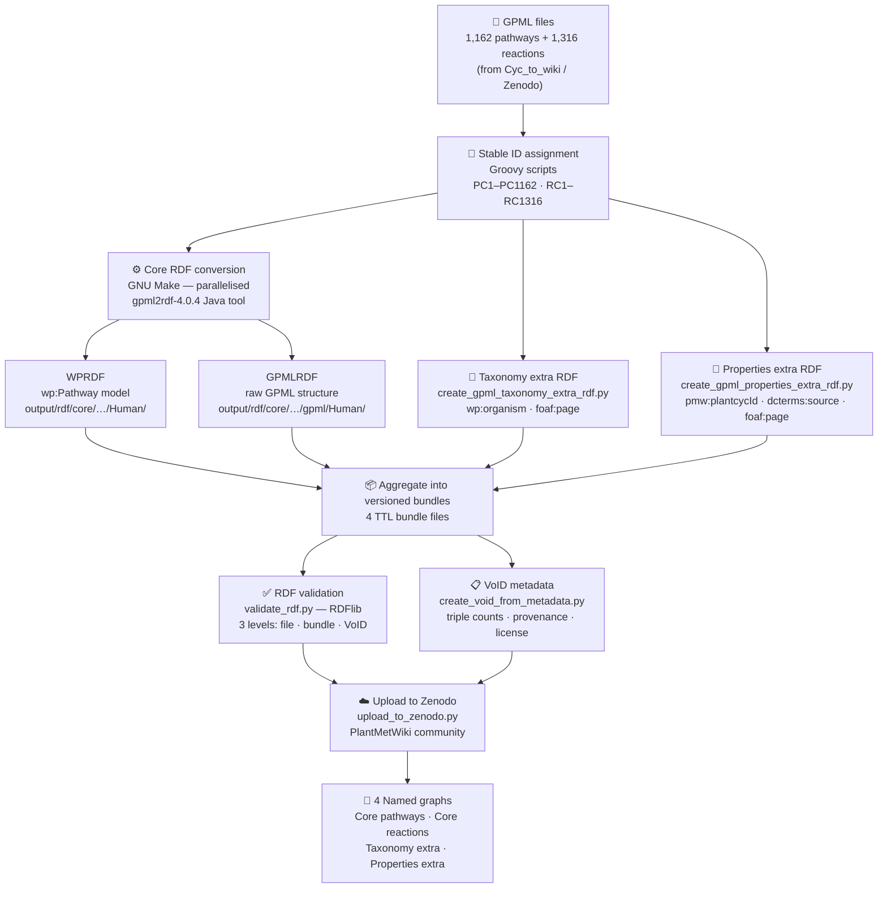

# GPML-to-RDF Pipeline Overview

Workflow diagram for the PlantMetWiki RDF generation pipeline.
Rendered automatically by GitHub. For an editable version, import into
[draw.io](https://app.diagrams.net) via **File → Import → Mermaid**,
or paste into [mermaid.live](https://mermaid.live) for a quick PNG/SVG export.

